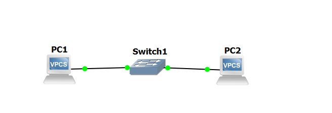
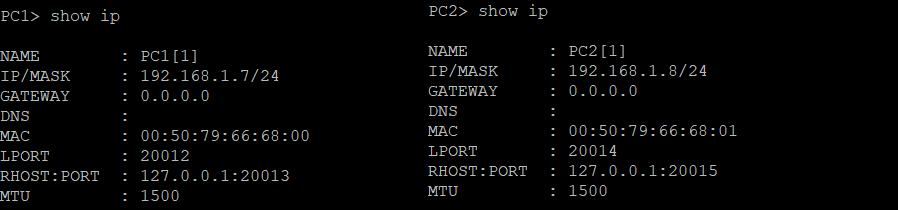
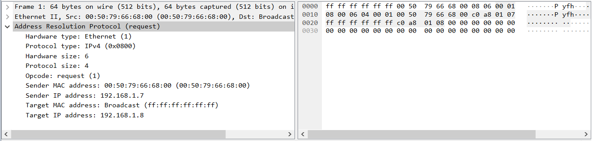
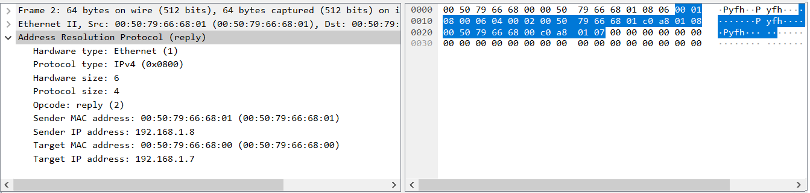
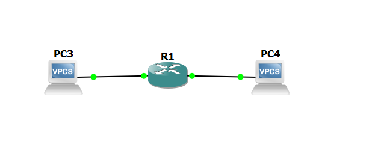
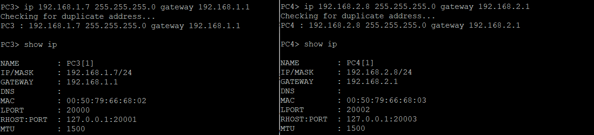
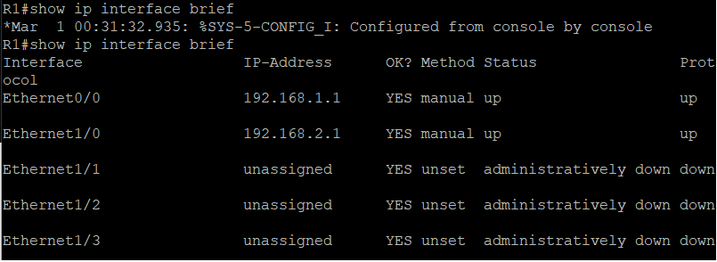
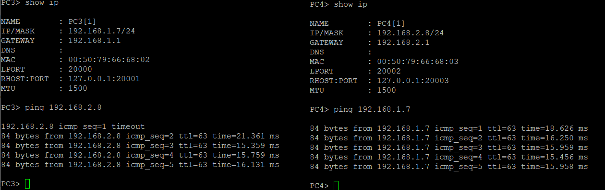
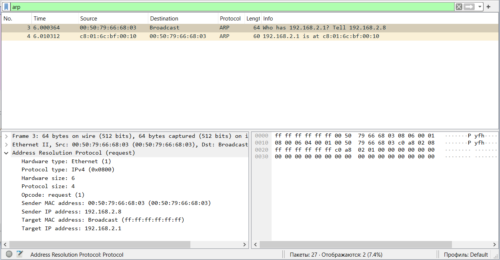
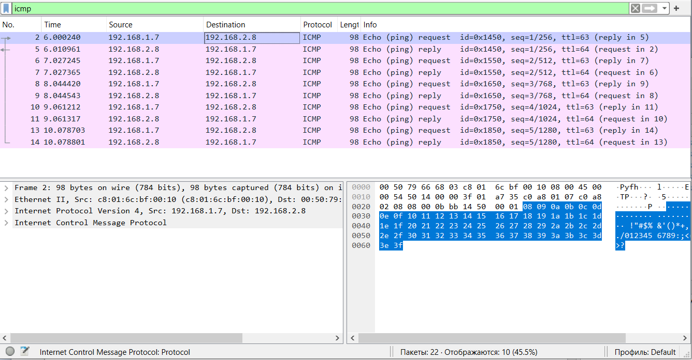

# Лабораторная работа №1
Тема: Освоение инструментария для выполнения работ, построение простой сети  

## Создать простейшую сеть, состоящую из 1 коммутатора и 2 компьютеров, назначить им произвольные ip адреса из одной сети
  
    
## Запустить симуляцию, выполнить команду ping с одного из компьютеров, изпользуя ip адрес второго компьютера
   
## Перехватить трафик протокола arp на всех линках и проанализировать заголовки пакетов в программе Wireshark, для фильтрации трафика, относящегося к указанному протоколу использовать фильтры Wireshark
- Отображения всех ARP пакетов.  
  
- ARP запрос
  
- ARP ответ    
        

Вывод: В результате перехвата трафика и анализа заголовков пакетов были выявлены  моменты:
 - ARP-запрос:  
    Отправитель: PC1 (MAC: 00:50:79:66:68:00, IP: 192.168.1.7)  
    Широковещательная рассылка: who has IP-адрес 192.168.1.8?  
  - ARP-ответ:  
    Отправитель: PC2 (MAC: 00:50:79:66:68:01, IP: 192.168.1.8)  
    Ответ:  192.168.1.8 имеет MAC-адрес 00:50:79:66:68:01  

Эти пакеты подтверждают, что процесс разрешения IP-адресов в MAC-адреса функционирует корректно.
## Создать простейшую сеть, состоящую из 1 маршрутизатора и 2 компьютеров, назначить им произвольные ip адреса из разных сетей
     

- Настройки компьютеров  

  

- Настройки маршрутизатора  

        
## Запустить симуляцию, выполнить команду ping с одного из компьютеров, изпользуя ip адрес второго компьютера
    
## Перехватить трафик протокола arp и icmp на всех линках, проанализировать заголовки пакетов в программе Wireshark, для фильтрации трафика, относящегося к указанному протоколу использовать фильтры Wireshark

- arp 

  

- icmp

  

Были захвачены ARP запросы и ответы. Запросы `Who has` содержали запросы о разрешении MAC-адресов для конкретных IP-адресов, а ответы `is at` содержали соответствующие MAC-адреса.  

Для icmp каждый `Echo (ping) request` отображается соответствующим `Echo (ping) reply`, что свидетельствует о том, что обмен пакетами проходит успешно и без потерь.
