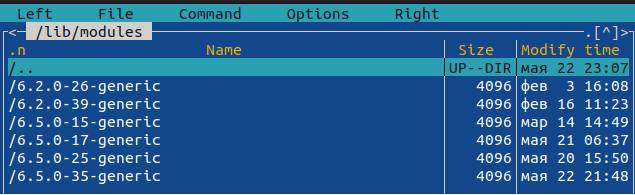
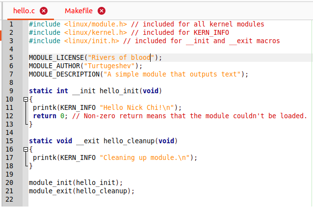
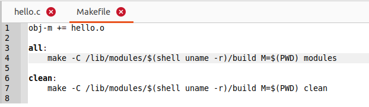
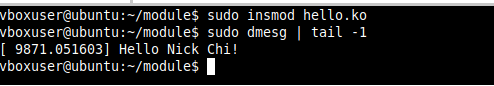
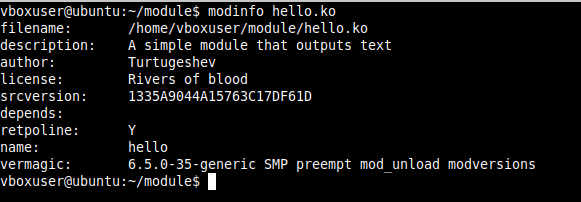
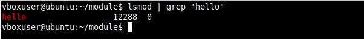

# Установка заголовков Linux
apt-get install build-essential linux-headers-$(uname -r)  
- Версии заголовок ядер  

   
## Cоздайте следующий модуль hello.c  
- Введите лицензию, автора и описание того что делает модуль  

   

## Cоздайте Makefile  

   

## Введите команду insmod hello.ko  
- `insmod` вставит новый модуль в ядро  
- Ввести команду `dmesg | tail -1` для просмотра системного журнала  
- Чтобы проверить список 
  

## Введите команду modinfo hello.ko чтобы просмотреть информацию о параметрах модуля  

 

## Введите команду lsmod hello.ko | grep "hello" чтобы посмотреть что модуль находится в системе  

 
